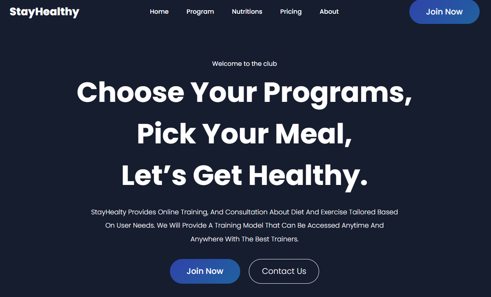

# StayHealthy

A responsive landing page for a fictional fitness platform promoting workout programs, healthy meal plans, and membership packages.

> **Project Screenshot**
> 

## Live Demo

**Demo:** https://developer-mykhailo.github.io/StayHealthy/

## Overview

StayHealthy is a modern landing page designed to showcase fitness programs and encourage users to join a healthy lifestyle community. The page focuses on clean presentation, clear content hierarchy, and responsive layout.

## Features

- Responsive landing page layout
- Hero section with call-to-action
- Workout programs section
- Meal preparation section
- Membership pricing plans
- Benefits overview with feature cards
- Call-to-action section
- Structured footer with navigation

## Tech Stack

- HTML5
- CSS3
- SCSS
- Responsive Web Design

## Getting Started

1. Clone the repository.

```bash
git clone https://github.com/Developer-Mykhailo/StayHealthy.git
```

2. Open `index.html` in your browser.

## What I Learned

- Building responsive landing page layouts
- Organizing styles using SCSS partials
- Creating reusable UI sections
- Improving semantic HTML structure
- Applying modern CSS layout techniques
